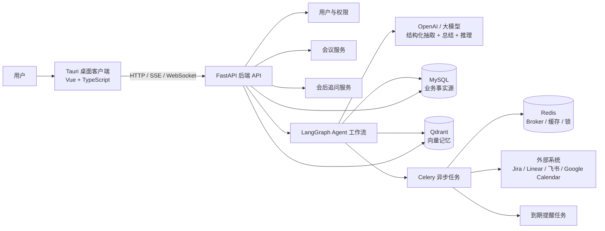
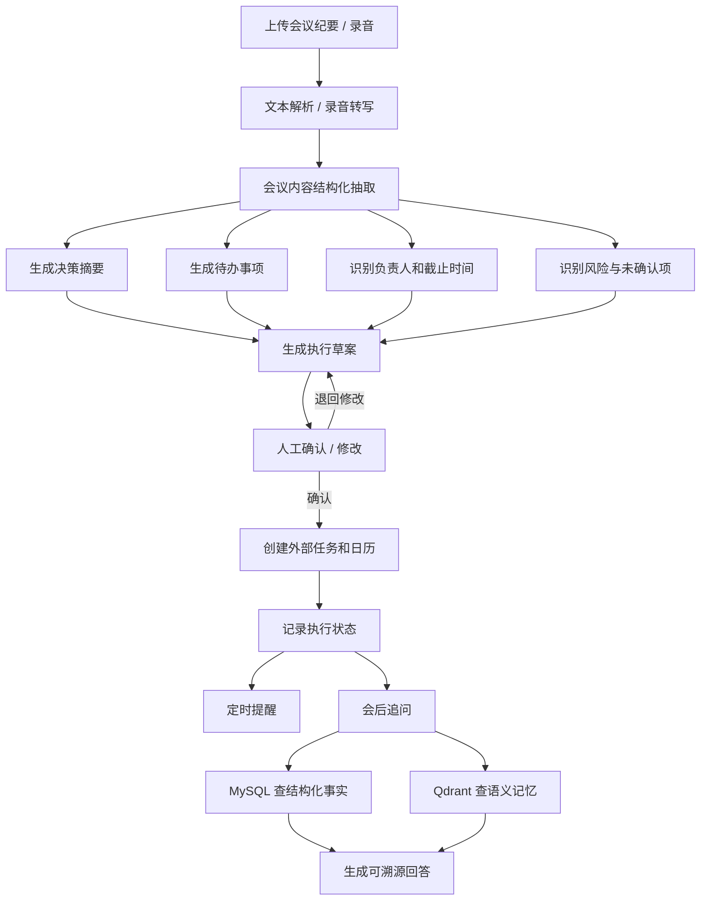
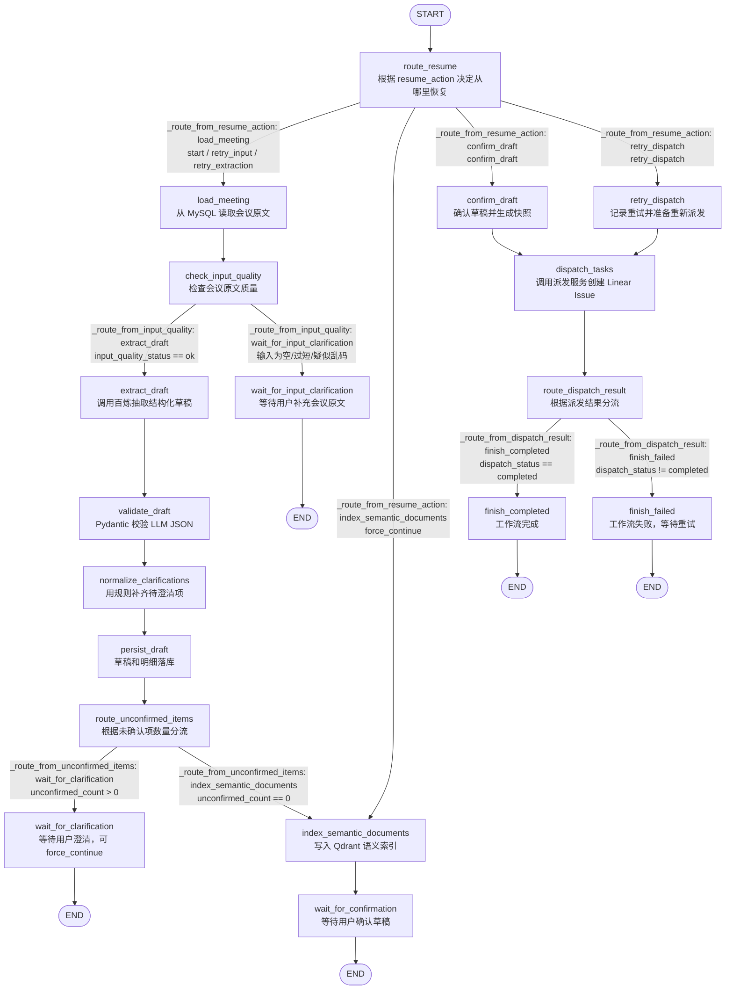

# Meeting Execution Agent 项目架构图

这个项目的核心目标是：把会议内容变成可确认、可派发、可追踪、可恢复、可追问的执行闭环。

## 总体架构



## 核心业务流程



## 模块职责

- 桌面客户端：上传会议、查看解析结果、人工确认、任务看板、追问对话、集成配置。
- FastAPI 后端：业务 API、鉴权、会议管理、任务管理、追问接口、工作流触发。
- LangGraph：编排会议解析、执行草案、人工确认、外部任务创建、失败恢复。
- MySQL：保存会议、纪要、决策、待办、负责人、截止时间、确认记录、外部任务 ID、提醒状态。
- Qdrant：保存会议原文、决策、待办和历史问答的向量索引，用于语义追问。
- Redis + Celery：处理转写、解析、向量入库、外部系统调用、失败重试、到期提醒。

## 项目能力闭环

```text
会议输入
  -> Agent 理解
  -> 人审确认
  -> 外部执行
  -> 状态追踪
  -> 到期提醒
  -> 历史追问
```

