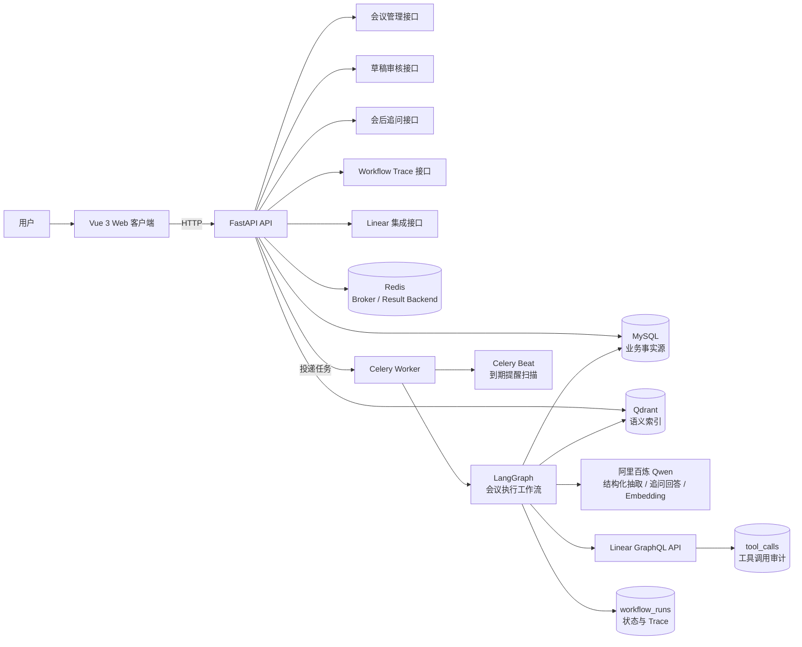
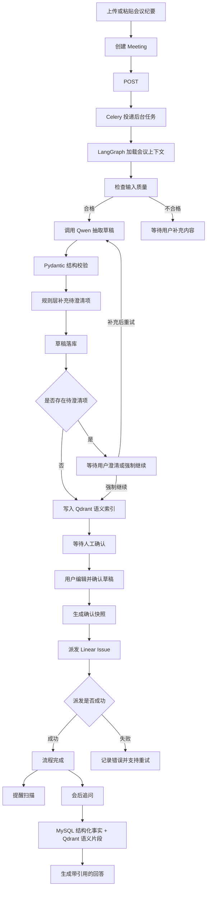
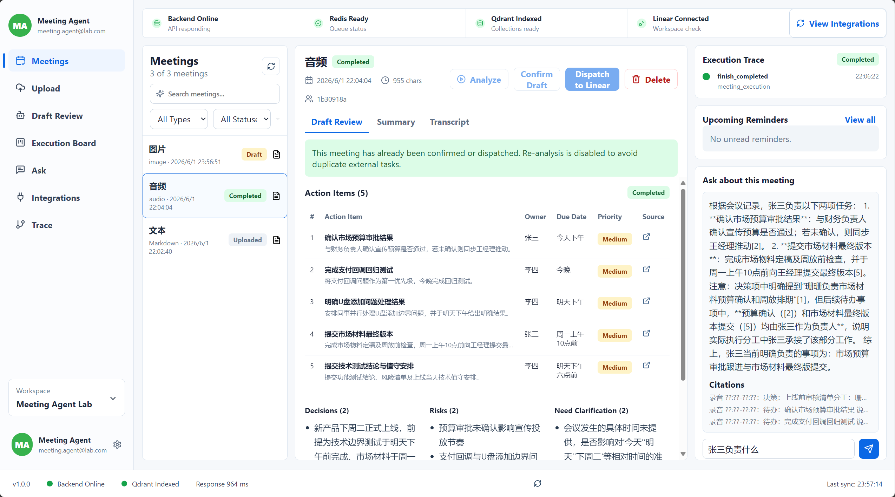

# Meeting Execution Agent

一个面向会议后执行管理的 Agentic Workflow 项目：把会议纪要自动转成可审核、可派发、可追踪、可追问的执行闭环。

项目重点展示的不只是“调用大模型抽取内容”，而是完整的工程闭环：长流程编排、人审确认、外部工具集成、状态持久化、语义检索、异步任务、提醒和评测。

## 项目目标

会议结束后，很多执行信息会散落在纪要、聊天记录和个人记忆里。本项目希望解决这类问题：

- 从会议纪要中抽取决策、待办、负责人、截止时间、风险和待澄清项。
- 生成可编辑的执行草案，用户确认后才允许外部派发。
- 将确认后的待办派发到 Linear，并记录外部任务 ID、状态和错误。
- 用 MySQL 保存业务事实，用 Qdrant 保存语义索引，支持会后追问。
- 用 LangGraph + Celery 编排可恢复长流程，让每一步状态都可追踪。
- 用 LangSmith 做离线评测，评估抽取、追问和工具调用稳定性。

## 当前能力

- 上传或粘贴会议纪要，支持文本、Markdown、语音和图片。
- 使用 Qwen 抽取结构化会议结果。
- LangGraph 编排会议执行工作流，支持等待澄清、强制继续、人工确认和派发恢复。
- 人工审核草稿，可修改任务标题、负责人、截止时间、说明和优先级。
- 将确认后的待办派发到 Linear。
- MySQL 保存会议、草稿、待办、确认快照、提醒、工作流和工具调用记录。
- Qdrant 保存会议片段、决策和待办的语义索引。
- Redis + Celery 处理异步分析、派发、索引和提醒扫描。
- Vue Web 客户端查看会议、草稿、Trace、提醒和追问。
- LangSmith 离线评测抽取、追问和工具稳定性。

## 技术架构图



## 核心业务流程



## 技术栈

| 模块 | 技术 |
| --- | --- |
| 后端 API | FastAPI, Pydantic v2 |
| 工作流编排 | LangGraph |
| 异步任务 | Redis, Celery, Celery Beat |
| 数据库 | MySQL, SQLAlchemy Async, Alembic |
| 向量检索 | Qdrant |
| LLM / Embedding | 阿里百炼 OpenAI-compatible API, Qwen, text-embedding-v3 |
| 外部集成 | Linear GraphQL API |
| 前端 | Vue 3, TypeScript, Vite, Pinia, Vue Router |
| 评测 | LangSmith, Pytest |

## 快速启动指南

### 1. 准备基础服务

需要先准备：

- Python 3.12
- Node.js 18+
- MySQL 8+
- Redis
- Qdrant
- 阿里百炼 API Key
- Linear API Key 和默认 Team ID

### 2. 配置后端环境变量

```powershell
cd E:\MyWork\Agent\meeting-execution-agent
Copy-Item backend\.env.example backend\.env
```

编辑 `backend/.env`，至少填写：

```env
MYSQL_HOST=localhost
MYSQL_PORT=3306
MYSQL_USER=root
MYSQL_PASSWORD=your_password
MYSQL_DATABASE=meeting_execution_agent

REDIS_URL=redis://127.0.0.1:6379/0
CELERY_BROKER_URL=redis://127.0.0.1:6379/0
CELERY_RESULT_BACKEND=redis://127.0.0.1:6379/0

QDRANT_URL=http://127.0.0.1:6333

DASHSCOPE_API_KEY=your_dashscope_key
DASHSCOPE_BASE_URL=https://dashscope.aliyuncs.com/compatible-mode/v1
LLM_MODEL=qwen-plus-latest
EMBEDDING_MODEL=text-embedding-v3
EMBEDDING_DIMENSIONS=1024

LINEAR_API_KEY=your_linear_key
LINEAR_API_URL=https://api.linear.app/graphql
LINEAR_DEFAULT_TEAM_ID=your_linear_team_id

LANGSMITH_API_KEY=your_langsmith_key
LANGSMITH_TRACING=true
LANGSMITH_PROJECT=meeting-execution-agent-evals
```

不要把真实 API Key 提交到 Git。

### 3. 安装后端依赖

```powershell
cd E:\MyWork\Agent\meeting-execution-agent\backend
& "D:\anaconda3\envs\Agent\python.exe" -m pip install -e ".[dev]"
```

### 4. 初始化数据库

确保 MySQL 中已经创建数据库：

```sql
CREATE DATABASE meeting_execution_agent CHARACTER SET utf8mb4 COLLATE utf8mb4_unicode_ci;
```

执行迁移：

```powershell
cd E:\MyWork\Agent\meeting-execution-agent\backend
& "D:\anaconda3\envs\Agent\python.exe" -m alembic upgrade head
```

### 5. 启动 Redis 和 Qdrant

Redis：

```powershell
redis-server.exe
```

Qdrant：

```powershell
cd D:\Qdrant
.\qdrant.exe
```

如果本机开了系统代理，建议每个后端相关终端先设置本地绕过：

```powershell
$env:NO_PROXY="localhost,127.0.0.1,::1"
$env:no_proxy=$env:NO_PROXY
```

### 6. 启动后端服务

FastAPI：

```powershell
cd E:\MyWork\Agent\meeting-execution-agent\backend
& "D:\anaconda3\envs\Agent\python.exe" -m app.main
```

Celery Worker：

```powershell
cd E:\MyWork\Agent\meeting-execution-agent\backend
& "D:\anaconda3\envs\Agent\python.exe" -m celery -A app.workers.celery_app worker --loglevel=info --pool=solo
```

Celery Beat：

```powershell
cd E:\MyWork\Agent\meeting-execution-agent\backend
& "D:\anaconda3\envs\Agent\python.exe" -m celery -A app.workers.celery_app beat --loglevel=info
```

健康检查：

```text
GET http://127.0.0.1:8003/health
GET http://127.0.0.1:8003/health/redis
GET http://127.0.0.1:8003/health/qdrant
```

### 7. 启动前端

```powershell
cd E:\MyWork\Agent\meeting-execution-agent
npm.cmd --prefix desktop install
npm.cmd --prefix desktop run dev
```

默认访问：

```text
http://127.0.0.1:5173
```

## 效果截图



## 测试与评测

后端测试：

```powershell
cd E:\MyWork\Agent\meeting-execution-agent\backend
& "D:\anaconda3\envs\Agent\python.exe" -m ruff check app tests
& "D:\anaconda3\envs\Agent\python.exe" -m pytest
```

前端测试：

```powershell
cd E:\MyWork\Agent\meeting-execution-agent
npm.cmd --prefix desktop run typecheck
npm.cmd --prefix desktop run build
npm.cmd --prefix desktop run test:e2e
```

LangSmith 评测：

```powershell
cd E:\MyWork\Agent\meeting-execution-agent\backend
& "D:\anaconda3\envs\Agent\python.exe" -m app.evals.run_langsmith_evals --suite extraction --limit 3
& "D:\anaconda3\envs\Agent\python.exe" -m app.evals.run_langsmith_evals --suite all
```

评测数据集：

```text
backend/app/evals/datasets/meeting_eval_cases.jsonl
```

## 目录结构

```text
meeting-execution-agent/
  backend/
    app/
      agents/              # LangGraph 工作流
      api/routers/         # FastAPI APIRouter 分组
      core/                # 配置、日志、Redis 等基础设施
      db/                  # SQLAlchemy session/base
      evals/               # LangSmith 评测
      integrations/        # Linear 与外部工具 adapter
      llm/                 # 百炼 LLM / embedding 封装
      models/              # SQLAlchemy 模型
      retrieval/           # Qdrant 访问层
      schemas/             # Pydantic schema
      services/            # 业务服务
      workers/             # Celery app 和任务
    alembic/               # 数据库迁移
    tests/                 # 后端测试
  desktop/                 # Vue Web 客户端
  samples/                 # 示例会议纪要
  PROJECT_OVERVIEW.md      # 架构图和流程图
  DEVELOPMENT_ROADMAP.md   # 开发路线
  Question.md              # 面试问答整理
```
